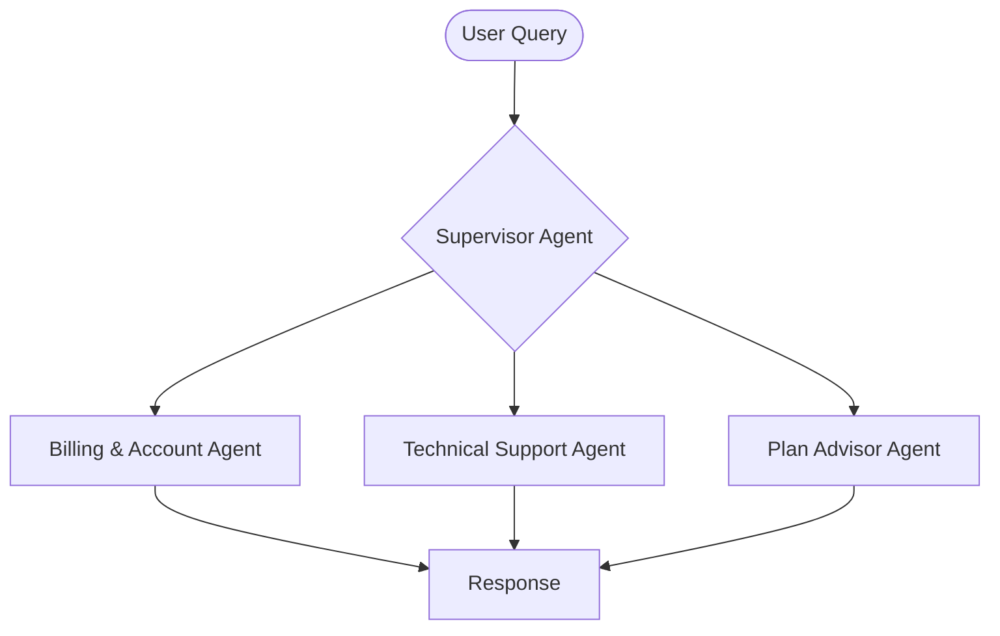

# ConnectTel Telecom Multi-Agent System

This is a telecom customer service multi-agent system built with LangGraph and Chainlit. It demonstrates how AI agents can handle various telecom support scenarios including network issues, billing inquiries, technical support, and service management. Read our [blog](https://galileo.ai/blog/evaluate-langgraph-multi-agent-telecom) for implementation details, metrics and how to use Galileo in the console.

## Overview

This app is a customer service chatbot for the fictional telecom provider, **ConnectTel**. The system uses multiple specialized agents to handle different aspects of telecom customer support, all orchestrated by a supervisor agent.

### Key Features

- **Multi-Agent Architecture**: Specialized agents for different telecom domains
- **Mock Data System**: No live APIs required except Pinecone - perfect for demos and testing
- **Realistic Scenarios**: Simulates real telecom support interactions
- **Comprehensive Coverage**: Handles network, billing, technical, and service issues

## What You Can Do

Ask the bot about:

- 💰 **Billing & Usage**: Review bills, track data usage, understand charges
- 🔧 **Technical Support**: Troubleshoot connectivity issues, configure devices
- 📊 **Plan Recommendations**: Get personalized plan suggestions based on usage

## System Architecture

### Tech Stack

- **LangGraph**: Agent orchestration and workflow management
- **Chainlit**: User interface for chat interactions
- **Pinecone**: Vector database for knowledge retrieval
- **Galileo**: Monitoring and evaluation platform

### Agents

The system consists of three specialized agents, all coordinated by a supervisor:


#### 1. Billing & Account Agent
Handles all billing-related inquiries, usage tracking, and account management.

**Tools**: `BillingTool`
- Check account balance and due dates
- Track data, voice, and text usage
- Review billing history
- Suggest plan optimizations

#### 2. Technical Support Agent
Provides troubleshooting assistance and device configuration support.

**Tools**: `TechnicalSupportTool`
- Step-by-step troubleshooting guides
- Device configuration (APN, WiFi calling)
- Service resets and escalations
- Diagnostic codes

#### 3. Plan Advisor Agent
Analyzes customer needs and recommends suitable plans and services.

**Tools**: `PineconeRetrievalTool`
- Compare plan features
- Identify savings opportunities
- Recommend add-ons and bundles
- Explain plan benefits

### Supervisor Agent Architecture



## Mock Data System

Since this is a demo system without live telecom APIs, all tools use mock data generators that provide:

- **Realistic Responses**: Coherent, context-aware information
- **Dynamic Values**: Randomized metrics (signal strength, speeds, etc.)
- **Consistent State**: Maintains session context
- **Multiple Scenarios**: Simulates various support situations

### Example Mock Data

- **Customer Accounts**: Multiple customer profiles with different plans
- **Troubleshooting Guides**: Common issues and solutions
- **Plan Catalog**: Various individual, family, and business plans

## Setup Instructions

### Prerequisites

- Python 3.10+
- [OpenAI API Key](https://platform.openai.com/api-keys)
- [Pinecone Account](https://www.pinecone.io) 
- [Galileo Account](https://app.galileo.ai/sign-up) 

### Installation

1. **Clone the repository**
```bash
git clone https://github.com/rungalileo/sdk-examples
cd sdk-examples/python/agent/langgraph-telecom-agent
```

2. **Set up environment variables**
```bash
cp .env.example .env
# Edit .env with your API keys
```

3. **Install dependencies**
```bash
# Using uv (recommended)
uv sync --dev

# Or using pip with pyproject.toml
pip install -e .
```

4. **Set up vector database (optional - only needed for Plan Advisor Agent)**
```bash
# Upload telecom documentation to Pinecone
# This will create a "telecom" index with plan information and troubleshooting guides
python ./scripts/setup_pinecone.py
```

### Running the Application

**Start the Chainlit UI**
```bash
chainlit run app.py -w
```

The application will be available at [http://localhost:8000](http://localhost:8000)

**Test the tools directly**
```bash
python test_tools.py
```

## Example Interactions

### Billing Inquiry
**User**: "What's my current data usage?"
**Bot**: Shows data consumption, remaining allowance, and average daily usage

### Technical Support
**User**: "My internet is really slow"
**Bot**: Provides troubleshooting steps, checks network congestion, suggests optimizations

### Plan Advice
**User**: "I need a plan with international calling"
**Bot**: Recommends suitable plans with international features, compares options


## Project Structure

```
langgraph-telecom-agent/
├── app.py                              # Main Chainlit application
├── src/
│   └── galileo_langgraph_fsi_agent/
│       ├── agents/                     # Agent implementations
│       │   ├── supervisor_agent.py     # Orchestrator
│       │   ├── billing_account_agent.py
│       │   ├── technical_support_agent.py
│       │   └── plan_advisor_agent.py
│       └── tools/                      # Mock tool implementations
│           ├── billing_tool.py
│           ├── technical_support_tool.py
│           └── pinecone_retrieval_tool.py
└── source-docs/                        # Telecom knowledge base
    ├── telecom-plans.md               # Plan catalog
    └── network-troubleshooting.md     # Support guides
```

## Monitoring with Galileo
- View traces at [app.galileo.ai](https://app.galileo.ai) after running conversations.
- Setup agent metrics like Action Completion, Tool Selection Quality and Tool Error Rate
- You can also add a [custom metric](https://galileo.ai/blog/evaluate-langgraph-multi-agent-telecom#performance-benchmarks-for-production) as per your bespoke requirements
- Read our [blog](https://galileo.ai/blog/evaluate-langgraph-multi-agent-telecom) for a detailed guide on metrics and debugging agent with the insights.