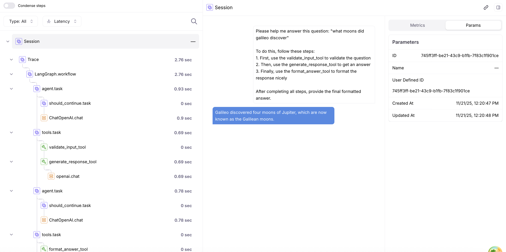

# LangGraph + Traceloop + Galileo Integration

This example demonstrates how to add comprehensive observability to your LangGraph AI workflows using **Traceloop** (OpenLLMetry) and Galileo. Traceloop provides a simpler alternative to direct OpenTelemetry instrumentation while still giving you detailed traces showing execution flow, LLM calls, token usage, and input/output data.


## Quick start

### Prerequisites

- Python 3.12+
- [UV package manager](https://docs.astral.sh/uv/getting-started/installation/)
- [Galileo account](https://app.galileo.ai) (free)
- OpenAI API key

### Installation

```bash
# Clone and navigate
git clone https://github.com/rungalileo/sdk-examples
cd sdk-examples/python/agent/langgraph-traceloop

# Install dependencies
uv sync

# Create environment file
cp .env.example .env
# Edit .env with your API keys (see below)
```

### Environment variables

Create a `.env` file in the project root with the following variables:

```bash
# Your Galileo API key (get from https://app.galileo.ai/settings/api-keys)

TRACELOOP_BASE_URL=https://api.galileo.ai/otel

TRACELOOP_HEADERS="Galileo-API-Key=your_galileo_api_key_here, project=traceloop, logstream=default, X-Use-Otel-New=true"

# Your OpenAI API key
OPENAI_API_KEY=your_openai_api_key_here
```

| Variable             | Required | Description                                                             |
| -------------------- | -------- | ----------------------------------------------------------------------- |
| `TRACELOOP_BASE_URL` | Yes      | The base URL for the Traceloop Client it will send traces to galileo    |
| `TRACELOOP_HEADERS`  | Yes      | The headers for the Traceloop Client to send to galileo                 |
| `OPENAI_API_KEY`     | Yes      | Your OpenAI API key from [OpenAI](https://platform.openai.com/api-keys) |

### Run

```bash
uv run python main.py
```

This runs a question-answering LangGraph workflow with comprehensive Traceloop tracing. Check your Galileo project for detailed traces!

## Example Trace in Galileo

After running the agent, you'll see a detailed trace in the Galileo UI showing the complete execution flow:


