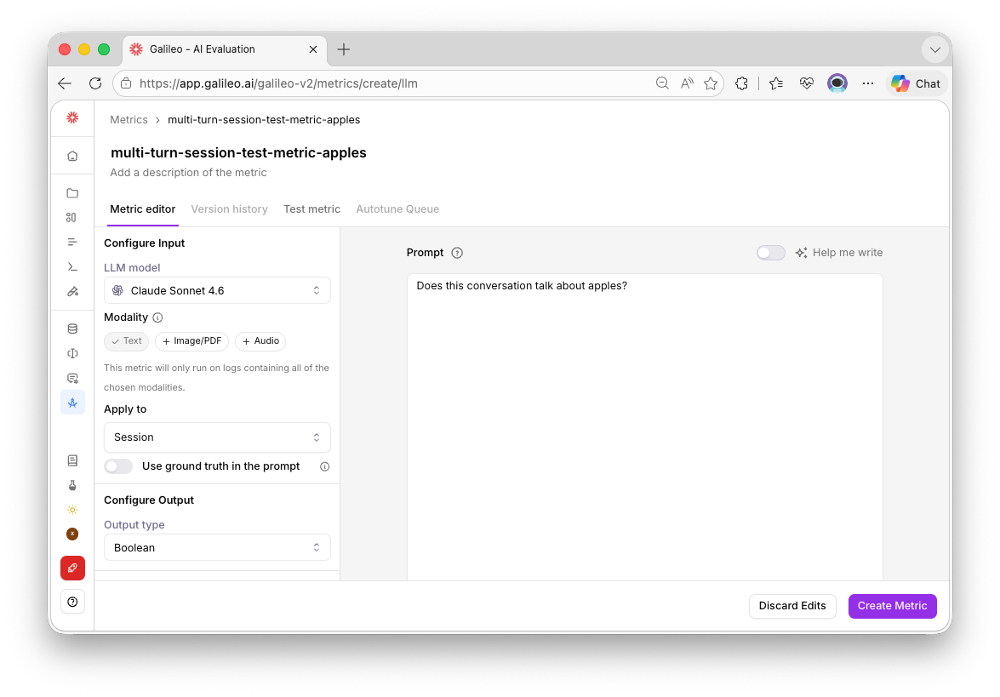

# Multi-Turn Experiment Example

The example in this folder demonstrates how to use [create_experiment](https://docs.galileo.ai/sdk-api/python/reference/experiments#create_experiment) to compute a session-level metric for a multi-turn conversation. 

## Setup Instructions

### 1. Create and Activate Virtual Environment

```bash
# Navigate to the example folder
cd python/experiments/multi-turn

# Create virtual environment
python -m venv venv

# Activate virtual environment
source venv/bin/activate
```

### 2. Install Dependencies

Run

```bash
pip install -r requirements.txt
```

### 3. Configure Environment Variables

Your `.env` should look like this. Feel free to follow the `.env.example` and enter your credentials

```bash

# Required: Your Galileo API key
GALILEO_API_KEY="your-galileo-api-key"

# Required: Galileo project name
GALILEO_PROJECT="your-galileo-project"

# Provide the console url below if you are not using app.galileo.ai
# GALILEO_CONSOLE_URL="your-galileo-console-url"
```

## Basic Example

Run the basic example:

```bash
python basic-example.py
```

The `METRIC_NAME` variable in this script cites a session-level metric.

Pre-defined session-level metrics include:

- `GalileoMetrics.conversation_quality`
- `GalileoMetrics.action_completion`
- `GalileoMetrics.action_advancement`
- `GalileoMetrics.agent_efficiency`
- `GalileoMetrics.context_adherence`
- `GalileoMetrics.context_relevance`
- `GalileoMetrics.tool_error_rate`

Related documentation: [Metrics Comparison](https://docs.galileo.ai/concepts/metrics/metric-comparison)

Optionally, you can define your own custom session-level metric in the Galileo Console UI, and then add the custom metric name. 



