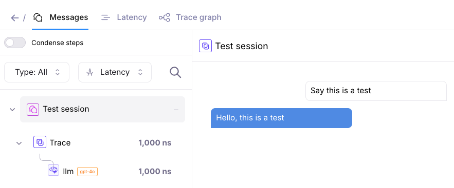
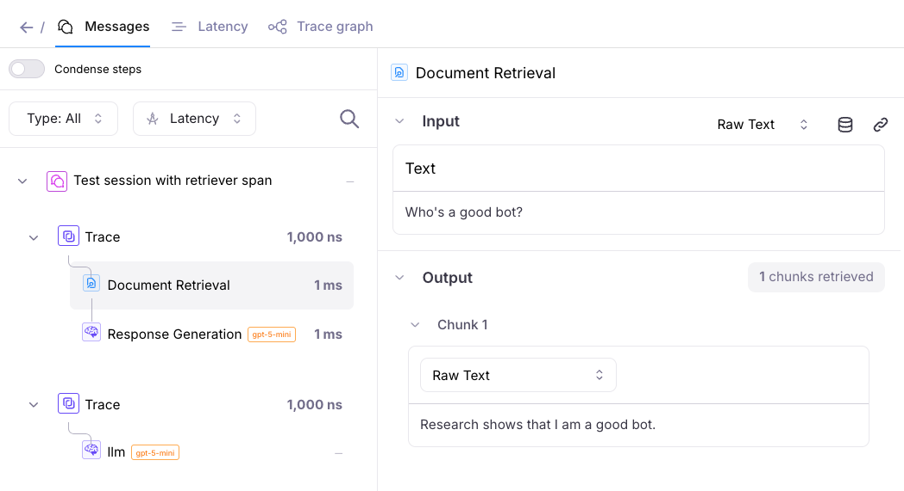

# GalileoLogger Examples

The examples in this folder demonstrates how to use [`GalileoLogger`](https://v2docs.galileo.ai/sdk-api/python/reference/logger/logger) to log data to Galileo. Other ways of logging to Galileo can be found in [how-to guides](https://v2docs.galileo.ai/how-to-guides/basics/basic-example).

## Setup Instructions

### 1. Create and Activate Virtual Environment

```bash
# Navigate to the "galileologger" example folder
cd python/logging-samples/galileologger

# Create virtual environment
python -m venv venv

# Activate virtual environment
source venv/bin/activate 
```

### 2. Install Dependencies
Run

```bash
pip install -r requirements.txt
```

### 3. Configure Environment Variables
Your `.env` should look like this. Feel free to follow the `.env.example` and enter your credentials
```bash

# Required: Your Galileo API key
GALILEO_API_KEY="your-galileo-api-key"

# Optional: Galileo project and log stream names
GALILEO_PROJECT="your-galileo-project"
GALILEO_LOG_STREAM=galileologger-example

# Provide the console url below if you are not using app.galileo.ai
# GALILEO_CONSOLE_URL="your-galileo-console-url"
```

## Basic Example

Run the basic example:

```bash
python basic-example.py
```

This example's expected output includes the Galileo URL of the log stream. 

Go to this link in your browser and click on the session to confirm the logged data.

Screenshot of the logged data:




## Retriever Example

Run the retriever example:

```bash
python retriever-example.py
```

This example logs a more complex trace with multiple spans, including a retriever span.

The expected output includes the Galileo URL of the log stream. Go to this link in your browser and click on the session to confirm the logged data.


Screenshot of the logged data:





