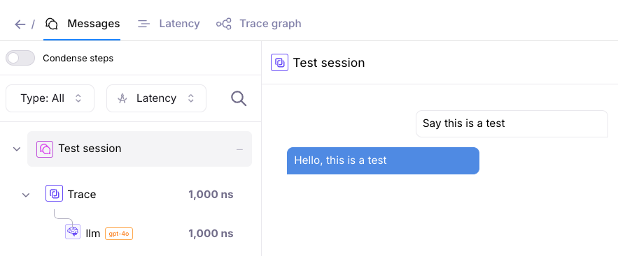
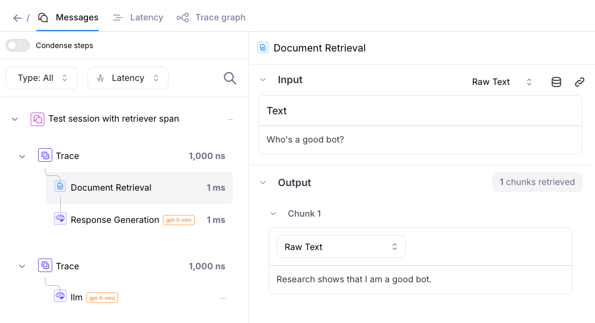
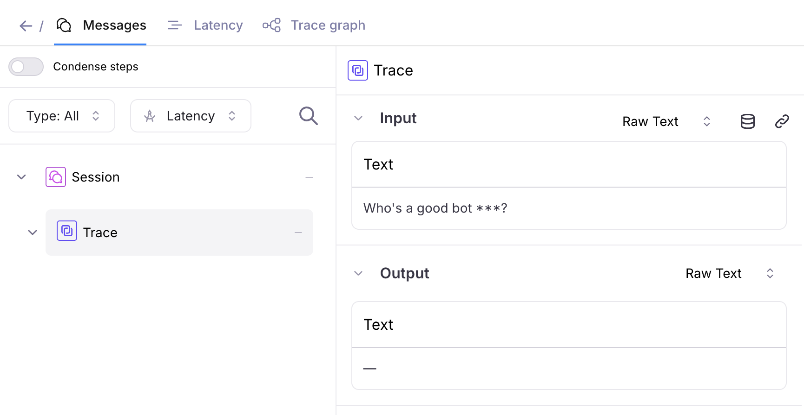
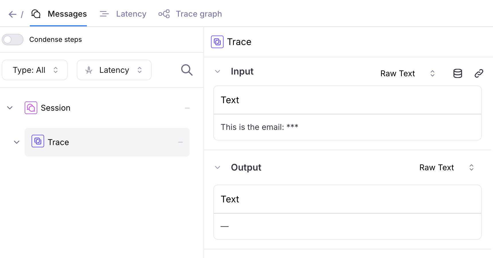
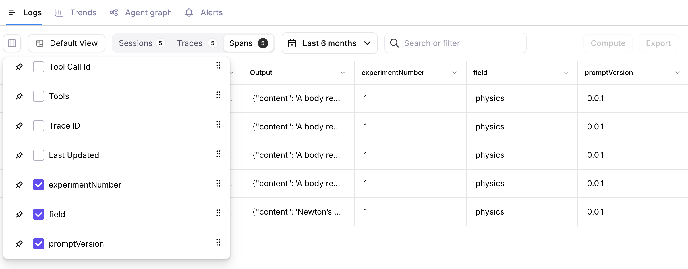
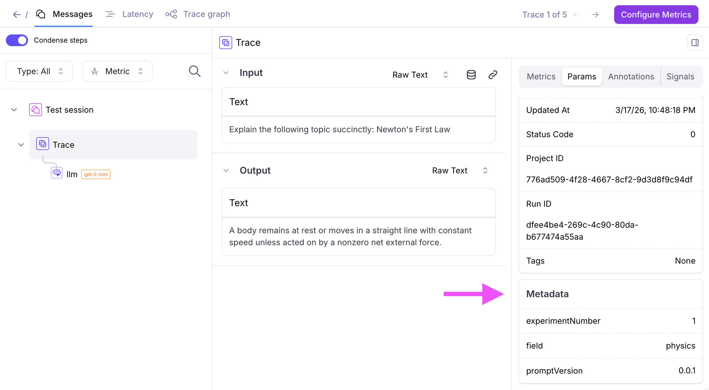

# GalileoLogger Examples

The examples in this folder demonstrates how to use [`GalileoLogger`](https://docs.galileo.ai/sdk-api/python/reference/logger/logger) to log data to Galileo. Other ways of logging to Galileo can be found in [how-to guides](https://docs.galileo.ai/how-to-guides/basics/basic-example).

## Setup Instructions

### 1. Create and Activate Virtual Environment

```bash
# Navigate to the "galileologger" example folder
cd python/logging-samples/galileologger

# Create virtual environment
python -m venv venv

# Activate virtual environment
source venv/bin/activate
```

### 2. Install Dependencies

Run

```bash
pip install -r requirements.txt
```

### 3. Configure Environment Variables

Your `.env` should look like this. Feel free to follow the `.env.example` and enter your credentials

```bash

# Required: Your Galileo API key
GALILEO_API_KEY="your-galileo-api-key"

# Optional: Galileo project and log stream names
GALILEO_PROJECT="your-galileo-project"
GALILEO_LOG_STREAM=galileologger-example

# Provide the console url below if you are not using app.galileo.ai
# GALILEO_CONSOLE_URL="your-galileo-console-url"
```

## Basic Example

Run the basic example:

```bash
python basic-example.py
```

This example's expected output includes the Galileo URL of the log stream.

Go to this URL in your browser to confirm the logged data.

Screenshot of the logged data:



## Retriever Example

Run the retriever example:

```bash
python retriever-example.py
```

This example logs a more complex trace with multiple spans, including a retriever span.

The example's expected output includes the Galileo URL of the log stream. Go to this URL in your browser to confirm the logged data.

Screenshot of the logged data:



## Redaction Example

Run the redaction example:

```bash
python redaction-example.py
```

This example logs traces with `redacted_input` (input excluding sensitive info such as social security numbers or email adddresses).

The optional parameters `redacted_input` and `redacted_output` can be provided to [`GalileoLogger`](https://docs.galileo.ai/sdk-api/python/reference/logger/logger) methods such as [`start_trace`](https://docs.galileo.ai/sdk-api/python/reference/logger/logger#start_trace) and [`add_retriever_span`](https://docs.galileo.ai/sdk-api/python/reference/logger/logger#add_retriever_span).

The example's expected output includes an export of logged traces, as well as the Galileo URL of the log stream. Go to this URL in your browser to confirm the logged data.

Screenshots of the logged data with sensitive info redacted:





## Metadata Example

Run the metadata example:

```bash
python metadata-example.py
```

This example logs a session, trace, and span with metadata (optional key-value attributes).

The optional parameter `metadata` can be provided to [`GalileoLogger`](https://docs.galileo.ai/sdk-api/python/reference/logger/logger) methods such as [`start_session`](https://docs.galileo.ai/sdk-api/python/reference/logger/logger#start_session), [`start_trace`](https://docs.galileo.ai/sdk-api/python/reference/logger/logger#start_trace) and [`add_llm_span`](https://docs.galileo.ai/sdk-api/python/reference/logger/logger#add_llm_span).

The example's expected output includes the Galileo URL of the log stream. Go to this URL in your browser to confirm the logged data.

Screenshots of the logged data with metadata:




