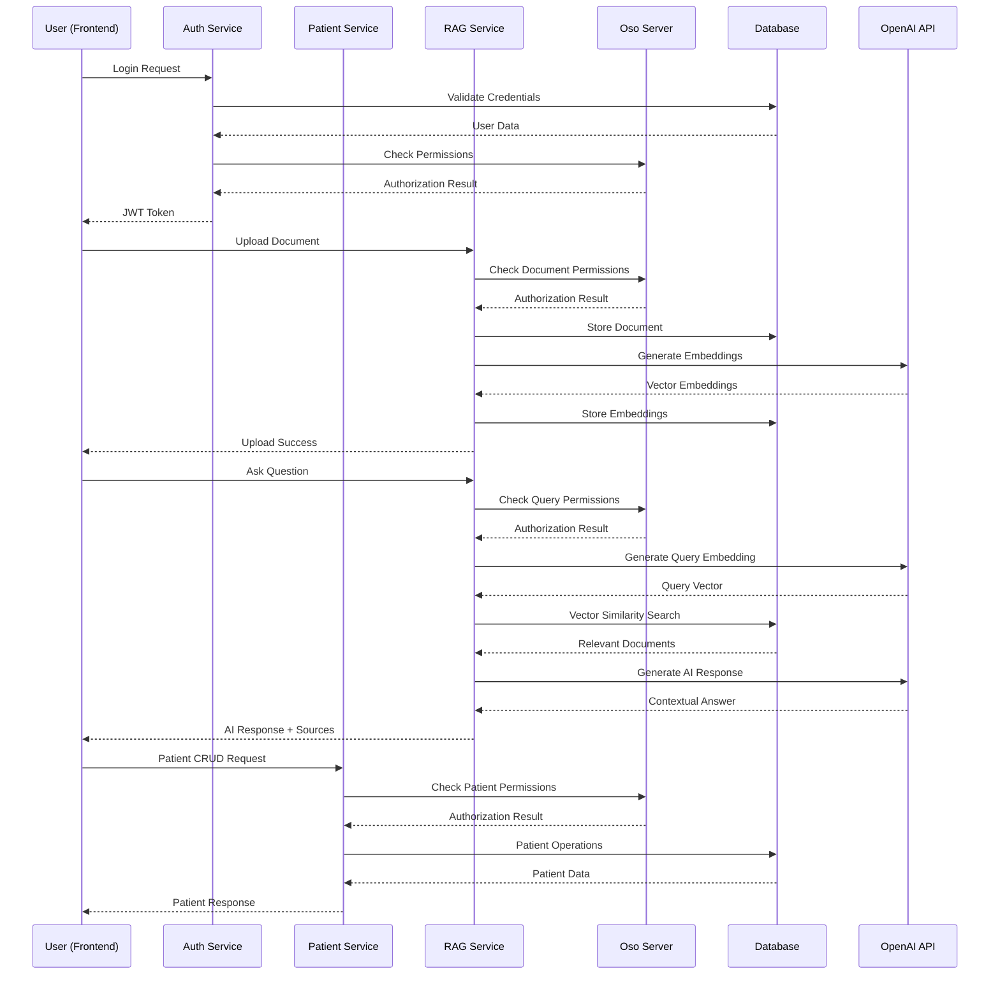

# Healthcare Support Portal Architecture

## System Overview

The Healthcare Support Portal is a **secure, microservices-based RAG (Retrieval-Augmented Generation) application** designed for healthcare professionals. It provides AI-powered document management, intelligent Q&A, and role-based access control for medical teams.

## Architecture Diagram

```mermaid
graph TB
    %% User Interface Layer
    subgraph "🌐 Frontend Layer (Port 3000)"
        UI[React Router 7 + Vite]
        Auth[Authentication Context]
        API[API Client (Axios)]
        UI --> Auth
        UI --> API
    end

    %% API Gateway / Load Balancer (Future)
    subgraph "🔀 API Layer"
        LB[Load Balancer<br/>Future Enhancement]
    end

    %% Microservices Layer
    subgraph "🔧 Microservices Architecture"
        subgraph "🔐 Auth Service (Port 8001)"
            AuthAPI[FastAPI Server]
            AuthDB[(User Management)]
            JWT[JWT Token Management]
            AuthAPI --> AuthDB
            AuthAPI --> JWT
        end

        subgraph "🏥 Patient Service (Port 8002)"
            PatientAPI[FastAPI Server]
            PatientDB[(Patient Records)]
            PatientAPI --> PatientDB
        end

        subgraph "🤖 RAG Service (Port 8003)"
            RAGAPI[FastAPI Server]
            RAGDB[(Document Store)]
            OpenAI[OpenAI Integration]
            Embeddings[Vector Embeddings]
            RAGAPI --> RAGDB
            RAGAPI --> OpenAI
            RAGAPI --> Embeddings
        end
    end

    %% Authorization Layer
    subgraph "⚖️ Authorization System (Port 8080)"
        OSO[Oso Dev Server]
        Policies[authorization.polar<br/>Policy Rules]
        OSO --> Policies
    end

    %% Database Layer
    subgraph "🗄️ Database Layer (Port 5432)"
        PostgreSQL[(PostgreSQL + pgvector)]
        subgraph "Database Tables"
            Users[Users Table]
            Patients[Patients Table]
            Documents[Documents Table]
            EmbeddingsTable[Embeddings Table]
        end
        PostgreSQL --> Users
        PostgreSQL --> Patients
        PostgreSQL --> Documents
        PostgreSQL --> EmbeddingsTable
    end

    %% Migration & DevOps
    subgraph "🔄 DevOps & Migration"
        Alembic[Alembic Migrations]
        Docker[Docker Compose]
        Scripts[Setup Scripts]
    end

    %% External Services
    subgraph "☁️ External Services"
        OpenAIAPI[OpenAI API<br/>GPT-4o-mini<br/>text-embedding-3-small]
        Galileo[Galileo AI<br/>Observability Platform]
    end

    %% Data Flow Connections
    UI --> LB
    LB --> AuthAPI
    LB --> PatientAPI
    LB --> RAGAPI

    %% Authorization Flow
    AuthAPI --> OSO
    PatientAPI --> OSO
    RAGAPI --> OSO

    %% Database Connections
    AuthAPI --> PostgreSQL
    PatientAPI --> PostgreSQL
    RAGAPI --> PostgreSQL

    %% External API Connections
    RAGAPI --> OpenAIAPI
    RAGAPI --> Galileo

    %% Migration Connections
    Alembic --> PostgreSQL
    Docker --> PostgreSQL
    Docker --> OSO

    %% Styling
    classDef frontend fill:#e1f5fe,stroke:#01579b,stroke-width:2px
    classDef service fill:#f3e5f5,stroke:#4a148c,stroke-width:2px
    classDef database fill:#e8f5e8,stroke:#1b5e20,stroke-width:2px
    classDef external fill:#fff3e0,stroke:#e65100,stroke-width:2px
    classDef auth fill:#fce4ec,stroke:#880e4f,stroke-width:2px

    class UI,Auth,API frontend
    class AuthAPI,PatientAPI,RAGAPI service
    class PostgreSQL,Users,Patients,Documents,EmbeddingsTable database
    class OpenAIAPI,Galileo external
    class OSO,Policies auth
```

## Component Details

### 🌐 Frontend Layer (React Router 7 + Vite)
- **Technology**: React Router 7, Vite, TypeScript, TailwindCSS v4
- **Components**: shadcn/ui components, responsive design
- **Features**: 
  - JWT-based authentication
  - Role-based UI adaptation
  - Real-time chat interface
  - Document management
  - Patient management

### 🔐 Auth Service (Port 8001)
- **Purpose**: User authentication, authorization, and management
- **Key Features**:
  - JWT token generation and validation
  - User registration with role assignment
  - Token refresh and session management
  - Oso policy enforcement integration
- **Endpoints**:
  - `POST /api/v1/auth/login` - User authentication
  - `POST /api/v1/auth/register` - User registration
  - `GET /api/v1/auth/me` - Current user info
  - `GET /api/v1/users/` - List users (with authorization)

### 🏥 Patient Service (Port 8002)
- **Purpose**: Patient record management with role-based access
- **Key Features**:
  - Patient CRUD operations with authorization
  - Doctor-patient assignment management
  - Department-based filtering and search
  - Soft delete for data preservation
- **Endpoints**:
  - `GET /api/v1/patients/` - List authorized patients
  - `POST /api/v1/patients/` - Create new patient
  - `GET /api/v1/patients/{id}` - Get patient details
  - `PUT /api/v1/patients/{id}` - Update patient

### 🤖 RAG Service (Port 8003)
- **Purpose**: AI-powered document management and intelligent assistance
- **Key Features**:
  - Document upload with automatic embedding generation
  - Vector similarity search using pgvector
  - Context-aware AI responses with OpenAI GPT
  - Role-based AI behavior and document access
- **Endpoints**:
  - `POST /api/v1/documents/` - Create/upload documents
  - `POST /api/v1/chat/search` - Semantic document search
  - `POST /api/v1/chat/ask` - AI-powered Q&A
  - `GET /api/v1/documents/` - List authorized documents

### ⚖️ Authorization System (Oso Dev Server - Port 8080)
- **Purpose**: Centralized policy management and enforcement
- **Key Features**:
  - Role-based access control (RBAC)
  - Fine-grained permissions
  - Department-based access controls
  - Hot-reloading during development
- **Policy Types**:
  - User management policies
  - Patient access policies
  - Document access policies
  - Embedding management policies

### 🗄️ Database Layer (PostgreSQL + pgvector - Port 5432)
- **Technology**: PostgreSQL with pgvector extension
- **Tables**:
  - **Users**: Authentication, roles, departments
  - **Patients**: Medical records, doctor assignments
  - **Documents**: Medical documents, policies, procedures
  - **Embeddings**: Vector embeddings for semantic search
- **Features**:
  - Vector similarity search
  - Full-text search capabilities
  - ACID compliance
  - Backup and recovery

## Data Flow Architecture



## Security Architecture

### 🔒 Authentication & Authorization
- **JWT-based authentication** with secure token management
- **Role-based access control** (Doctor, Nurse, Admin) using Oso policies
- **Fine-grained permissions** at the database level with SQLAlchemy integration
- **Department-based access controls** for multi-tenant healthcare environments

### 🛡️ Security Features
- **API Key Security**: OpenAI keys stored in environment variables
- **Content Filtering**: Sensitive document access controls
- **Audit Trail**: Document creation and access logging
- **Input Validation**: Sanitization of user inputs
- **Rate Limiting**: Protection against API abuse

## Technology Stack

### Backend Services
- **Framework**: FastAPI (Python 3.11+)
- **Database**: PostgreSQL with pgvector extension
- **Authentication**: JWT tokens with Oso authorization
- **AI/ML**: OpenAI GPT-4o-mini and text-embedding-3-small
- **Observability**: Galileo AI platform
- **Package Management**: uv (fast Python dependency management)

### Frontend
- **Framework**: React Router 7 (Framework mode)
- **Build Tool**: Vite 6
- **Styling**: TailwindCSS v4 (zero-config)
- **UI Components**: shadcn/ui with Radix UI primitives
- **State Management**: React Context + TanStack Query
- **HTTP Client**: Axios with interceptors

### DevOps & Infrastructure
- **Containerization**: Docker Compose
- **Database Migrations**: Alembic
- **Authorization**: Oso Dev Server (development) / Oso Cloud (production)
- **Monitoring**: Galileo AI observability platform

## Deployment Architecture

### Development Environment
- All services run locally with Docker Compose
- Oso Dev Server for policy management
- Local PostgreSQL with pgvector
- Hot-reloading for development

### Production Environment
- Containerized microservices
- Oso Cloud for authorization
- Production PostgreSQL cluster
- Load balancer for high availability
- Monitoring and logging infrastructure

## Scalability Considerations

### Horizontal Scaling
- **Stateless Services**: All microservices are stateless and can be scaled horizontally
- **Database Sharding**: Patient data can be sharded by department
- **Vector Search**: pgvector supports distributed vector operations
- **Caching**: Redis can be added for session and query caching

### Performance Optimization
- **Connection Pooling**: SQLAlchemy connection pooling
- **Async Operations**: FastAPI async/await for I/O operations
- **Vector Indexing**: pgvector HNSW indexes for fast similarity search
- **CDN**: Static assets served via CDN

## Monitoring & Observability

### Application Monitoring
- **Galileo AI**: AI performance monitoring and cost tracking
- **Structured Logging**: JSON logs for all services
- **Health Checks**: Service health endpoints
- **Metrics**: Request/response times, error rates

### Security Monitoring
- **Audit Logs**: All authorization decisions logged
- **Access Patterns**: User access pattern analysis
- **Anomaly Detection**: Unusual access pattern alerts
- **Compliance**: HIPAA-compliant logging and monitoring

## Future Enhancements

### Planned Features
- **API Gateway**: Centralized routing and rate limiting
- **Caching Layer**: Redis for improved performance
- **Message Queue**: Asynchronous document processing
- **Multi-tenancy**: Hospital-level data isolation
- **Mobile App**: React Native mobile application
- **Advanced Analytics**: Usage analytics and insights

### Integration Opportunities
- **EHR Systems**: Integration with existing Electronic Health Records
- **Medical Devices**: IoT device data integration
- **Telemedicine**: Video consultation integration
- **Compliance**: Enhanced HIPAA and SOC2 compliance features
