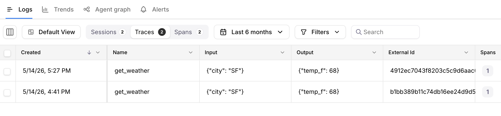
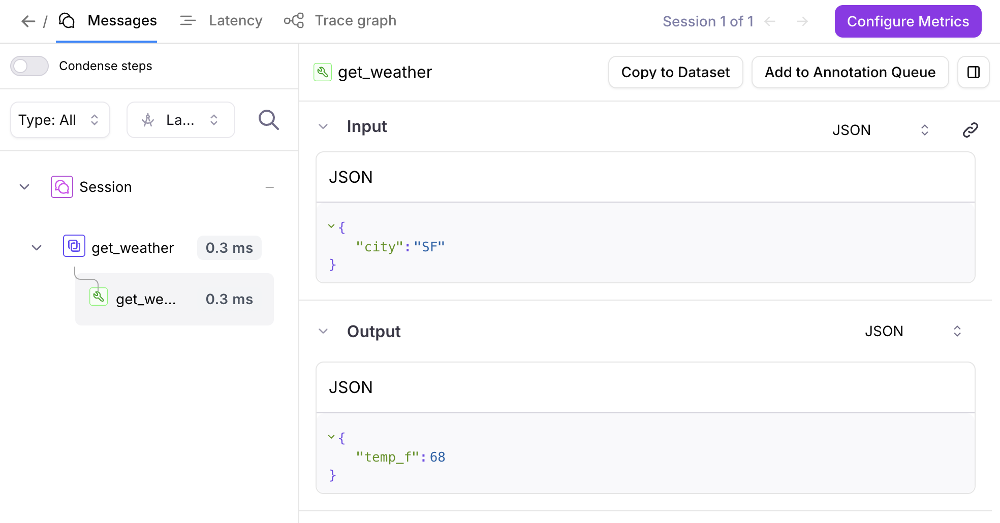

# OpenTelemetry Typescript example

This example sets up the `GalileoSpanProcessor` with OpenTelemetry. You can run this example to see traces appear in the Galileo console.

## Configure Environment Variables

Your `.env` should look like this. Feel free to follow the `.env.example` and enter your credentials

```bash

# Required: Your Galileo API key
GALILEO_API_KEY="your-galileo-api-key"

# Optional: Galileo project and log stream names
GALILEO_PROJECT="your-galileo-project"
GALILEO_LOG_STREAM=galileologger-example

# Provide the console url below if you are not using app.galileo.ai
# GALILEO_CONSOLE_URL="your-galileo-console-url"
```

## Run the basic example

Run the basic example:

```bash
npm install
npm start run
```

## View in the Galileo console

Confirm that you're able to view logged traces in the Galileo console.





